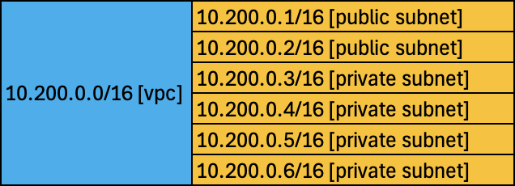
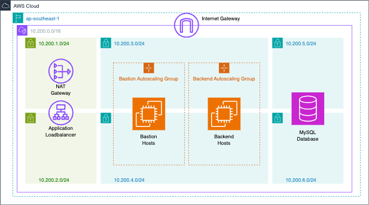
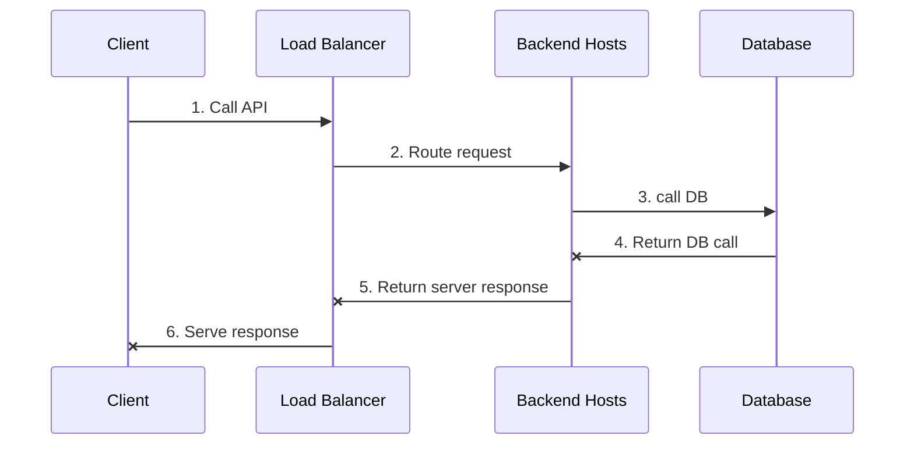

# AWS Three Tier Network

This project utilizes core AWS networking components to create a modern three tier architecture application.

## Core network components

- VPC
- Internet Gateway (to provide internet access for VPC)
- NAT Gateway (to provide internet access for private subnets)
- Network Access Control Lists (default allow)
- Private/Public Subnets
- Route tables
- Application Load Balancer
- Target Groups

## Network Segmentation Diagram




## Architecture Diagram



## Application Flow UML Diagram



## Running the stack

### Requirements
- Terraform ( version >= 1.9.6, refer to [installation docs](https://developer.hashicorp.com/terraform/install))
- AWS Account and IAM keys (refer to [AWS docs for generating IAM keys](https://docs.aws.amazon.com/IAM/latest/UserGuide/access-keys-admin-managed.html#admin-create-access-key))

###  Procedure

Clone the repository.
```
$ git clone https://github.com/thuaung30/aws-three-tier-network.git
```
Change directory to cloned folder.
```
$ cd aws-three-tier-network
```
Initialize terraform dependencies and modules. (make sure terraform version >= 1.9.6)
```
$ terraform init
```
Run terraform plan and carefully inspect the changes to be made.
```
$ terraform plan
```
Finally, once we are satisfied with the changes to be made, apply these changes to set up the whole application stack.
```
$ terraform apply
```
Once the whole application stack is up, copy the application load balancer url from terraform output and paste it in the browser window.
```
$ terraform output
```
We should be able to see Nginx server response since this project is configured to use the default nginx server.


## References
- [Terraform Documentation](https://developer.hashicorp.com/terraform/docs)
- [AWS Documentation](https://docs.aws.amazon.com/)
- [AWS Network Resources](https://docs.aws.amazon.com/vpc/?icmpid=docs_homepage_featuredsvcs)
- [IBM Three Tier Architecture](https://www.ibm.com/topics/three-tier-architecture)
